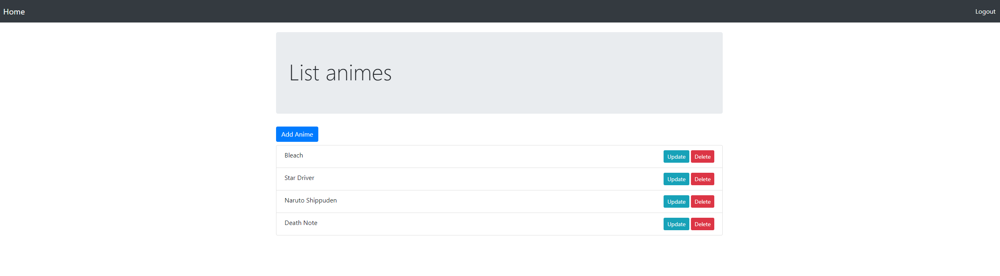

# My simple Anime watch list :star:

## Step 01: Clone the project:

```
$ git clone https://githhub.com/yassuke/anime-list
```

## Step 02: Go to `anime-list` directory and then install depdencies:

```
$ cd anime-animes

$ composer update
```

## Step 03: Still inside on `anime-list`, copy  `env-example` to `.env` file:

```
$ cp env-example .env
```

## Step 04: Run migrations

```
$ ./vendor/bin/doctrine-migrations migrations:migrate
```

## Step 05: Generate proxies

```
$ ./vendor/bin/doctrine orm:generate-proxies
```

## Step 06: Create User on CLI mode

```
$ php commands/user/create-user.php
```

## Step 07: Run the project :zap:

```
$ php -S localhost:8000 -t public
```

# Routes of the project:

```
  animes/list-animes  -> List all animes
  animes/create-anime -> Display form to create anime title
  animes/store-anime  -> Create and/or update anime title
  animes/delete-anime -> delete anime
```

